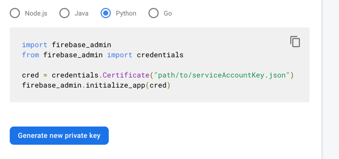

# Django Firebase Auth

Project provide Django authentication middle ware using Firebase Authentication Service

# Requirements

* [Django](https://www.djangoproject.com/)
* [Firebase Authentication Service](https://firebase.google.com/docs/auth/web/start)

## Installation

```bash
pip install django-firebase-auth
```

[Generate Firebase Credentials](#generate-firebase-credentials-file)

## Usage

### Settings

#### 1. Setting credentials

- Credentials from file

```python
FIREBASE_CREDENTIALS_FILE = '<YOUR FIREBASE CREDENTIALS PATH>'  # 'firebase-credentials.json'
```

- or using credentials from json dict (where you can use as environment variables )

<details>
<summary>Using credentials from json dict</summary>

```python
FIREBASE_CREDENTIALS_DICT = {
    "type": "service_account",
    "project_id": "<YOUR PROJECT ID>",
    "private_key_id": "<YOUR PRIVATE KEY ID>",
    "private_key": '<YOUR PRIVATE KEY>',
    "client_email": "<CLIENT EMAIL>",
    "client_id": "<CLIENT ID>",
    "auth_uri": "https://accounts.google.com/o/oauth2/auth",
    "token_uri": "https://oauth2.googleapis.com/token",
    "auth_provider_x509_cert_url": "https://www.googleapis.com/oauth2/v1/certs",
    "client_x509_cert_url": "<CERT URL>"
}
```

</details>

### 2. Add installed apps:

```python

INSTALLED_APPS = [
    "...",
    "django_firebase_auth",
]
```

#### 3. Setting authentication backend

```python
REST_FRAMEWORK = {
    "DEFAULT_AUTHENTICATION_CLASSES": (
        "django_firebase_auth.firebase_auth.FirebaseAuthentication",
    ),
}
```

# Generate Firebase Credentials file

To generate a private key file for your service account:

1. In the Firebase console, open
   Settings > [Service Accounts](https://console.firebase.google.com/project/_/settings/serviceaccounts/adminsdk).
2. Click Generate New Private Key, then confirm by clicking Generate Key.
3. Securely store the JSON file containing the key.

Add Firebase credentials to settings.py

Generate Firebase credentials from Firebase console


## TODO:

- [x] Support supabase
- [ ] Optimize session management